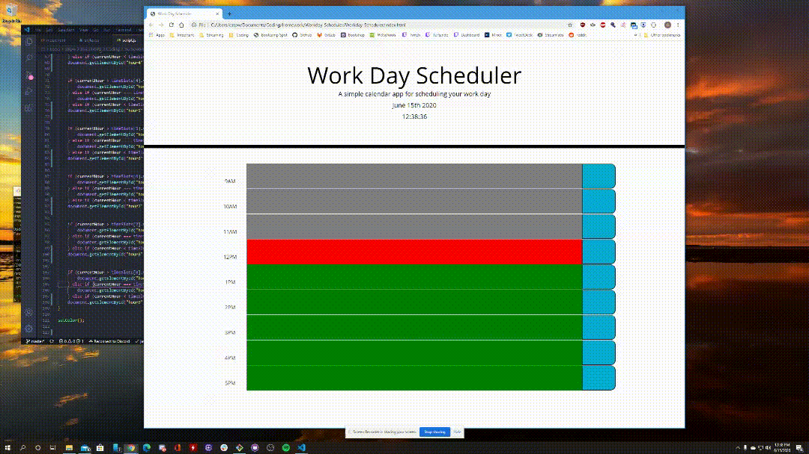
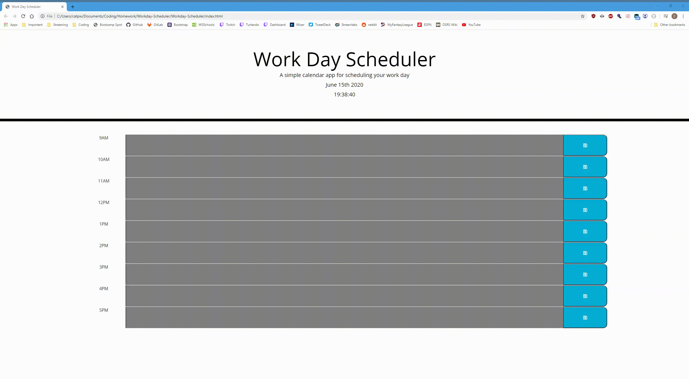

# Workday Scheduler

# Description 
In this application, I have designed a simple calendar planning schedule that allows the user to both log and record their own notes for each hour of the 9-5 workday. This application uses concepts of Bootstrap CSS, Javascript, jQuery and Moment.js.

# Table of Contents 
* [Installation](#installation)
* [Usage](#usage)
* [License](#license)
* [Contributors](#contributors)
* [Test](#test)
* [Questions](#questions)
* [Contact](#contact)

# Installation
 
This application has a functioning 24-hour clock/calendar running as long as the page is up- this ties into the user interface, which allows the use of color coordination, based on the time of the day. For example, if the user is to open the app at 2pm, the 2PM time block will be colored red, to let them know they are working in the current hour. The hours blocks proceeding 2pm will be grayed out, and potential hours left in the work day are left green.

# Usage

As for the functionality of storage, the user has the ability to keep the notes that he or she has written as long as they select the "save button icon" on the right hand of their input. If they are to refresh the page, the content will auto-fill accordingly to what they wrote and its respected time-slot.
Below are some live examples of this application:
 

# License

MIT

# Contributors

Christopher Turton

# Test

turtando.github.io/workday-scheduler/

# Questions

For any other questions in regards to this program or github, please contact Chris directly at christopheraturton@gmail.com or message him on Linkedin at https://www.linkedin.com/in/christopher-turton-a0002670/

## Contact
*To contact the developer, you may reach them at https://github.com/Turtando on GitHub or, you email directly at christopheraturton@gmail.com.*

